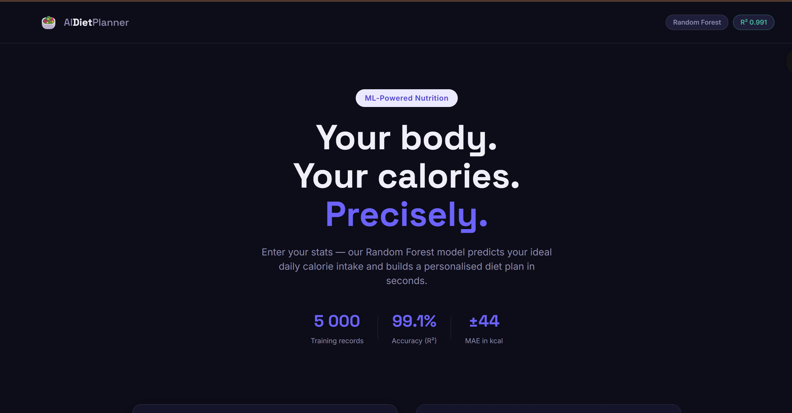

# 🥗 AI Diet Planner

> ML-powered personalized nutrition system that predicts daily calorie requirements and generates goal-based diet recommendations.

## 🚀 Live Demo

🌐 **Live Application:**
https://ai-diet-planner-98130aea9-raushanritik30891s-projects.vercel.app/

---

## 📸 Application Preview

### Landing Page


### Prediction Dashboard



---

## 📌 Project Overview

AI Diet Planner is a Machine Learning-powered web application that predicts personalized daily calorie requirements using a trained Random Forest Regression model.

The system analyzes user information such as age, gender, height, weight, activity level, and fitness goals to generate:

* 🎯 Daily Calorie Target
* 📊 BMI Analysis
* 🔥 BMR & TDEE Calculations
* 🥗 Personalized Diet Recommendations
* 🍗 Macronutrient Breakdown

---

## ✨ Features

* 🤖 Random Forest Regression Model
* 📈 99.1% R² Score
* 📊 BMI, BMR & TDEE Calculation
* 🥗 Goal-Based Diet Recommendations
* 📱 Fully Responsive Design
* 🌙 Modern Dark UI
* ⚡ Instant Predictions

---

## 🏗️ Machine Learning Pipeline

```text
User Input
     │
     ▼
Feature Engineering
(BMI, BMR, TDEE)
     │
     ▼
Label Encoding
     │
     ▼
Random Forest Regressor
     │
     ▼
Calorie Prediction
     │
     ▼
Diet Recommendation Engine
```

---

## 📊 Model Performance

| Metric       | Score         |
| ------------ | ------------- |
| R² Score     | 0.991         |
| MAE          | ±44 kcal      |
| RMSE         | 56 kcal       |
| Dataset Size | 5,000 Records |

### Model Comparison

| Model             | R² Score | MAE   |
| ----------------- | -------- | ----- |
| Linear Regression | 0.692    | 287.9 |
| Random Forest     | 0.991    | 44    |

🏆 **Selected Model:** Random Forest Regressor

---

## 🛠️ Tech Stack

### Machine Learning

* Python
* Scikit-Learn
* Pandas
* NumPy

### Frontend

* Next.js
* React
* Tailwind CSS

### Deployment

* Vercel

---

## 🎯 Business Use Cases

* Fitness Applications
* Nutrition Tracking Systems
* Health Tech Platforms
* Wellness Startups
* Personal Health Assistants

---

## 📂 Project Structure

```text
AI-Diet-Planner/
│
├── frontend/
│   ├── homepage.png
│   ├── prediction-dashboard.png
│
├── app/
├── components/
├── public/
├── models/
├── dataset/
├── README.md
└── requirements.txt
```

---

## 🔮 Future Improvements

* AI Meal Plan Generator
* User Authentication
* Nutrition Tracking Dashboard
* Fitness Tracker Integration
* XGBoost Model Comparison
* Health Progress Analytics

---

## 👨‍💻 Author

**Ritik Raushan**

B.Tech Artificial Intelligence & Machine Learning

### Connect With Me

* GitHub
* LinkedIn
* Portfolio

---

⭐ If you found this project useful, consider giving it a star on GitHub.
