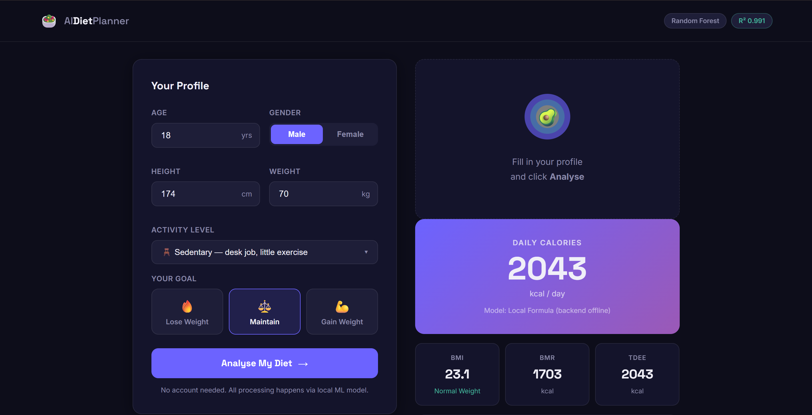

# 🥗 AI Diet Planner

> ML-powered personalized nutrition system that predicts daily calorie requirements and generates goal-based diet recommendations.

## 🚀 Live Demo

🌐 https://ai-diet-planner-98130aea9-raushanritik30891s-projects.vercel.app/

---

## 📸 Application Preview

### Landing Page


### Prediction Dashboard



---

## 📸 Application Preview

The application features a modern dark-themed interface powered by a trained Random Forest Machine Learning model.

### Landing Page


     │
     ▼
Label Encoding
     │
     ▼
Random Forest Regressor
     │
     ▼
Calorie Prediction
     │
     ▼
Diet Recommendation Engine
     │
     ▼
Interactive Dashboard
```

---

# 📊 Dataset Information

| Property        | Value                       |
| --------------- | --------------------------- |
| Dataset Size    | 5,000 Records               |
| Features        | 10                          |
| Target Variable | Daily Calories              |
| Data Type       | Synthetic Nutrition Dataset |
| Missing Values  | 0                           |
| Problem Type    | Regression                  |

### Features Used

```text
Age
Gender
Height
Weight
Activity Level
Goal
BMI
BMR
Activity Score
TDEE
```

---

# ⚙️ Machine Learning Pipeline

## Data Processing

### Feature Engineering

BMI:

```python
BMI = weight / (height / 100)²
```

BMR:

```python
Male:
10×weight + 6.25×height − 5×age + 5

Female:
10×weight + 6.25×height − 5×age − 161
```

TDEE:

```python
TDEE = BMR × Activity Score
```

---

## Models Evaluated

### Linear Regression

```text
R² Score : 0.692
MAE      : 287.9 kcal
RMSE     : 335.4 kcal
```

### Random Forest Regressor ⭐

```text
R² Score : 0.991
MAE      : 44 kcal
RMSE     : 56 kcal
```

---

# 🏆 Final Model Performance

| Metric           | Score    |
| ---------------- | -------- |
| R² Score         | 0.991    |
| MAE              | ±44 kcal |
| RMSE             | 56 kcal  |
| Training Samples | 5,000    |

### Why Random Forest?

* Captures non-linear relationships
* Handles feature interactions
* Less prone to overfitting
* High prediction accuracy

---

# ✨ Key Features

### 🤖 ML-Based Prediction

Predicts personalized calorie requirements.

### 📏 BMI Analysis

Automatic BMI calculation and classification.

### 🔥 BMR & TDEE Estimation

Scientifically validated metabolic calculations.

### 🥗 Personalized Diet Suggestions

Goal-based nutrition recommendations.

### 📱 Responsive Design

Optimized for:

* Desktop
* Tablet
* Mobile

### 🌙 Modern Dark UI

Professional glassmorphism-inspired design.

---

# 🛠️ Tech Stack

## Machine Learning

* Python
* Scikit-Learn
* Pandas
* NumPy

## Frontend

* Next.js
* React
* Tailwind CSS

## Deployment

* Vercel

---

# 📂 Project Structure

```text
AI-Diet-Planner/
│
├── app/
├── components/
├── public/
│
├── dataset/
│   └── diet_dataset.csv
│
├── models/
│   └── random_forest.pkl
│
├── notebooks/
│   └── training.ipynb
│
├── utils/
├── README.md
│
└── requirements.txt
```

---

# 📈 Business Impact

This system can be extended for:

* Fitness Applications
* Health Tech Platforms
* Nutrition Tracking Apps
* Wellness Startups
* Personal Health Assistants

---

# 🎤 Interview Questions You Can Answer

### Why Random Forest?

Because calorie requirements depend on complex interactions between weight, age, activity level, and fitness goals. Random Forest captures these non-linear relationships effectively.

### Why Regression Instead of Classification?

The output is a continuous calorie value rather than predefined categories.

### What is R² Score?

R² measures how much variance in the target variable is explained by the model.

```text
R² = 0.991
```

Meaning the model explains approximately **99.1%** of the variation in calorie requirements.

### What is MAE?

Average prediction error.

```text
MAE = ±44 kcal
```

---

# 🔮 Future Improvements

* Meal Plan Generation using LLMs
* User Authentication
* Nutrition Tracking
* Calorie History Dashboard
* XGBoost Integration
* Fitness Tracker Integration
* AI Health Assistant

---

# 👨‍💻 Author

## Ritik Raushan

B.Tech (AI & ML)

### Connect

* GitHub
* LinkedIn
* Portfolio

---

⭐ If you found this project useful, consider giving it a star on GitHub.
